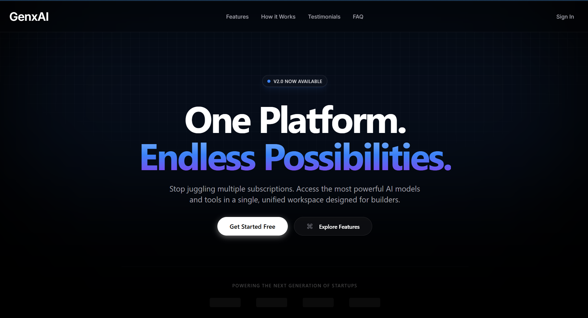
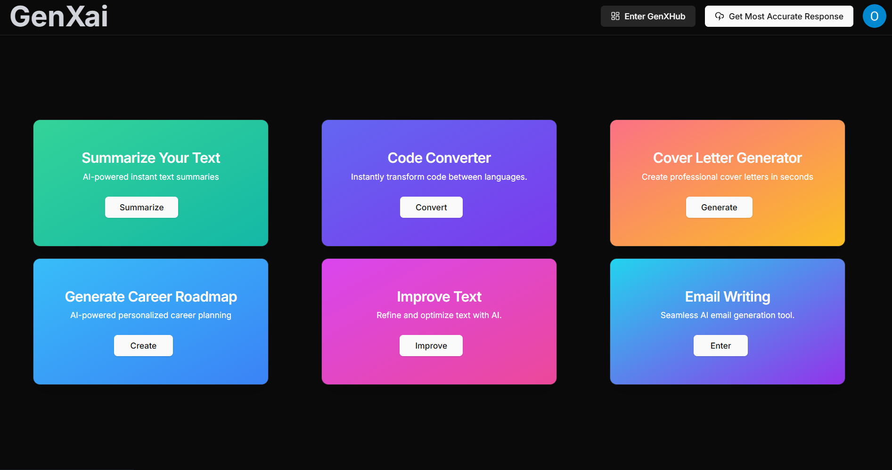

# 🚀 GenXai
### One Platform. Endless AI Possibilities.

[](https://genxai-psi.vercel.app)




*(The modern Bento Grid interface connecting all AI tools)*

---

## 📖 Table of Contents
1. [What is GenXai?](#-what-is-genxai)
2. [How It Works (Backend Engineering)](#-how-it-works-backend-engineering)
3. [Key Features](#-key-features)
4. [Tech Stack](#-tech-stack)
5. [Architecture & Flow](#-architecture--flow)
6. [Project Structure](#-project-structure)
7. [Installation](#-installation)

---

## 💡 What is GenXai?

**GenXai** is a unified AI-driven productivity platform built for performance and scalability. It aggregates 6+ advanced AI tools including code conversion, roadmap generation, and email writing into a single, modern dashboard.

Unlike simple API wrappers, **GenXai handles high-latency AI tasks asynchronously**. We engineered a custom backend architecture that processes heavy workloads in the background, ensuring the user interface remains responsive and never freezes, even when the AI takes 10+ seconds to generate a response.

---

## ⚙️ How It Works (Backend Engineering)

We implemented an **Event-Driven Architecture** using Spring Boot to optimize performance on resource-constrained environments (like Render Free Tier).

### 1. The "Ticket" System (Async Job Queue)
Direct HTTP calls to LLMs can time out browsers. We solved this with **Spring Boot `@Async`**.
* **The Problem:** AI models (like Gemini) take 5-15 seconds to reply. Blocking the HTTP thread destroys user experience.
* **The Solution:** When a user submits a request, the Controller immediately returns a **Job ID** (HTTP 202 Accepted).
* **The Worker:** A background thread picks up the job, processes the AI logic, and updates the database.
* **The Result:** The frontend polls for status updates, ensuring a non-blocking, reactive UI.

### 2. Smart "Personas" (Database-Driven Prompts)
AI models often "hallucinate" or add conversational fluff (e.g., *"Here is your code!"*), which breaks strict parsers.
* **The Solution:** We store system prompts in a PostgreSQL database, not hardcoded in Java.
* **Dynamic Tuning:** For the Code Converter, we enforce a **"Headless Compiler"** persona that outputs raw code only.
* **Benefit:** We can patch AI behavior instantly by updating the database record without redeploying the backend.

### 3. Secure Access (JWT)
* The API is secured using **Spring Security with JWT (JSON Web Tokens)**.
* Stateless authentication ensures scalability across distributed container instances.

---

## 🛠 Key Features

- **⚡ Code Converter:** Translates code between languages (e.g., Python ⇄ Java) with 100% syntax accuracy.
- **🗺️ Career Roadmap Generator:** Creates detailed, week-by-week learning paths for any technology.
- **📧 Cold Email Writer:** Generates professional, context-aware emails for job applications or outreach.
- **📝 Text Summarizer:** Condenses long technical papers into key bullet points.
- **💼 Cover Letter Builder:** Tailors professional cover letters based on resume snippets.
- **✨ Text Improver:** Refines grammar and tone for professional communication.

---

## 💻 Tech Stack

### Backend (The Brain)
- **Framework:** Java Spring Boot 3
- **Database:** PostgreSQL (Jobs, Prompts, Users)
- **Security:** Spring Security + JWT
- **Architecture:** Async/Await Pattern, Event-Driven
- **AI Integration:** Google Gemini API
- **DevOps:** Docker, Render

### Frontend (The Face)
- **Framework:** Next.js 14 (React)
- **Styling:** Tailwind CSS, Shadcn UI
- **Deployment:** Vercel

---

## 🏗 Architecture & Flow

This sequence diagram illustrates the **Async Polling Pattern** used to decouple the frontend from high-latency AI operations.

```mermaid
sequenceDiagram
    participant User
    participant Frontend
    participant Controller
    participant Worker
    participant Database

    User->>Frontend: Clicks "Generate"
    Frontend->>Controller: POST /api/ai/convert
    Controller->>Database: Create Job (Status: PENDING)
    Controller-->>Frontend: Return Job ID #123 (Instant 202)
    
    par Background Processing
        Controller->>Worker: Trigger Async Event
        Worker->>Database: Fetch Job & Prompt Persona
        Worker->>Worker: Call Google Gemini API
        Worker->>Database: Save Result (Status: COMPLETED)
    end

    loop Polling (Every 2s)
        Frontend->>Database: GET /job/123 status
    end
    
    Database-->>Frontend: Status: COMPLETED
    Frontend->>User: Display Result


## Project Structure

├── app/ (Frontend - Next.js)
│   ├── (auth)               # Authentication Pages
│   ├── generate-roadmap/    # Tool: Roadmap Logic
│   ├── components/          # UI Components (Bento Grid, Header)
│   └── lib/                 # API Utilities
│
├── aibackend/ (Backend - Spring Boot)
│   ├── src/main/java/com/genxai/
│   │   ├── controller/      # REST API Endpoints
│   │   ├── service/         # Async JobWorker & AI Logic
│   │   ├── entity/          # DB Models (Job, Prompt)
│   │   ├── config/          # JWT & Async Configuration
│   │   └── dto/             # Data Transfer Objects
│   └── resources/           # SQL Prompts & App Properties

```

## 🚀 Installation

### Prerequisites
- Java 17+
- Node.js 18+
- PostgreSQL
- Google Gemini API Key

