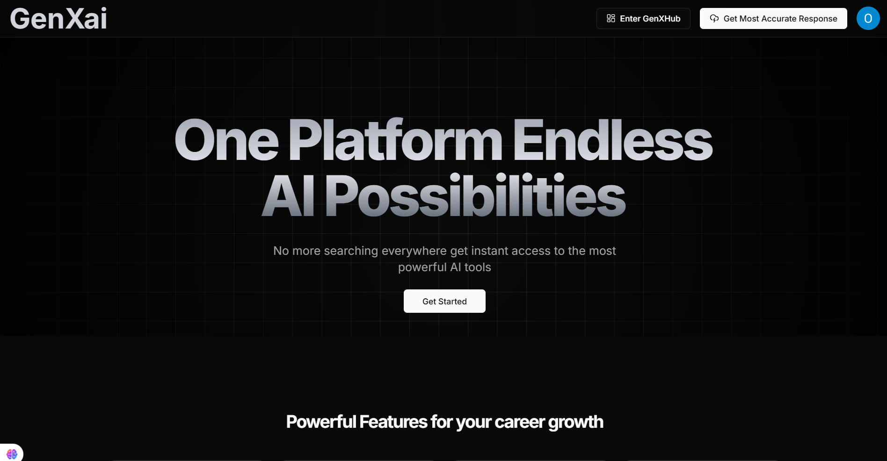
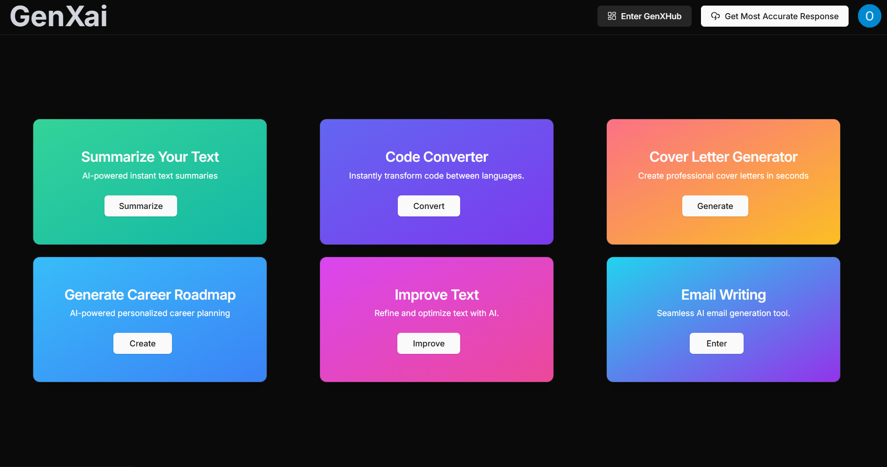

# GenXai
### One Platform Endless AI Possibilities


[](https://genxai-psi.vercel.app)  



---

## Table of Contents
1. [Overview](#overview)  
2. [Features](#features)  
3. [Technology Stack](#technology-stack)  
4. [Architecture & Project Structure](#architecture--project-structure)  
5. [Installation & Setup](#installation--setup)  
6. [Environment Variables](#environment-variables)  
7. [Usage](#usage)  
8. [Contributing](#contributing)  
9. [License](#license)  
10. [Contact](#contact)  

---

## Overview

**GenXai** is a unified AI-driven productivity platform for students and professionals, built with Spring Boot (backend), Next.js (frontend), Google Gemini API, Tailwind CSS, and Shadcn UI. The platform aggregates six+ advanced AI tools—text summarizer, code converter, cover-letter generator, email writer, AI-powered “accurate response” module, and an AI mock interview system—into a single seamless interface. Users can access instant career guidance, streamline their developer workflows, and optimize written content without jumping between multiple services :contentReference[oaicite:0]{index=0}.

---

## Features

- **Text Summarizer**  
  - Condenses long articles, papers, or any text while retaining essential points and context.  
  - Suitable for quick research overviews and note-taking. :contentReference[oaicite:1]{index=1}

- **Code Converter**  
  - Translates code snippets or entire functions between languages (e.g., Python ⇄ Java, JavaScript ⇄ TypeScript) while preserving logic and structure.  
  - Ideal for full-stack developers working with polyglot environments. :contentReference[oaicite:2]{index=2}

- **Cover Letter Generator**  
  - Generates a personalized, professional cover letter based on user-provided resume snippets and job descriptions.  
  - Utilizes AI to tailor tone, formatting, and content to industry standards. :contentReference[oaicite:3]{index=3}

- **Email Writer**  
  - Creates concise, context-aware email drafts (e.g., outreach, follow-up, thank-you notes) in seconds.  
  - Customizable “tone” options: Formal, Casual, Persuasive. :contentReference[oaicite:4]{index=4}

- **Accurate Response Module**  
  - Leverages Google Gemini’s REST API to deliver precise answers to technical or domain-specific questions.  
  - Aggregates responses from multiple AI models (including the AI Mock Interview engine) for comparison and refinement :contentReference[oaicite:5]{index=5}.

- **Responsive, Intuitive UI**  
  - Built with Next.js (React) and Shadcn UI components, styled via Tailwind CSS for a clean, modern experience.  
  - Mobile-first design ensures usability on any device. :contentReference[oaicite:8]{index=8}.

---

## Technology Stack

- **Frontend**  
  - Next.js (React)  
  - TypeScript  
  - Tailwind CSS  
  - Shadcn UI  
  - Clerk (Authentication)  

- **Backend**  
  - Spring Boot (Java 17+)  
  - RESTful endpoints for each AI tool  
  - WebSocket support (for real-time AI mock interview sessions)  

- **AI & API Integrations**  
  - Google Gemini API (Natural Language → MCQ generation, summarization, Q&A)  
  - OpenAI-compatible endpoints (optional fallback)  
  - Clerk.dev (Secure user authentication and session management)  


---

## Architecture & Project Structure

```text
/
├── app/
│   ├── (auth)
│   ├── accurate_response/
│   ├── ai-mock-interview/
│   ├── api/
│   ├── code-converter/
│   ├── cover-letter/
│   ├── email-writing/
│   ├── generate-roadmap/
│   ├── improve-text/
│   ├── example/
│   ├── components/
│   │   ├── ui/
│   │   ├── header.jsx
│   │   ├── hero.jsx
│   │   ├── SpinnerLoader.jsx
│   │   └── theme-provider.jsx
│   ├── data/
│   ├── lib/
│   ├── page.jsx
│   ├── layout.jsx
│   ├── not-found.jsx
│   └── globals.css
│
├── public/
│   └── images/
│
├── components.json
├── middleware.ts
├── next-env.d.ts
├── next.config.js
├── package.json
├── tailwind.config.js
├── postcss.config.js
├── .env
├── .gitignore
└── README.md
aibackend/
├── .idea/
├── mvnw
├── mvnw.cmd
├── pom.xml
├── Dockerfile
├── HELP.md
├── .gitignore
├── .gitattributes

Backend
├── src/
│   ├── main/
│   │   ├── java/
│   │   │   └── com/
│   │   │       └── genxai/
│   │   │           ├── controller/
│   │   │           ├── service/
│   │   │           └── AibackendApplication.java
│   │   └── resources/
│   │       ├── application.yml
│   │       └── static/
│   ├── test/
│   │   └── java/
│   │       └── com/
│   │           └── genxai/
│   └── mvnw, mvnw.cmd
├── target/
│   ├── classes/
│   ├── generated-sources/
│   ├── maven-status/
│   ├── surefire-reports/
│   └── test-classes/
└── README.md
